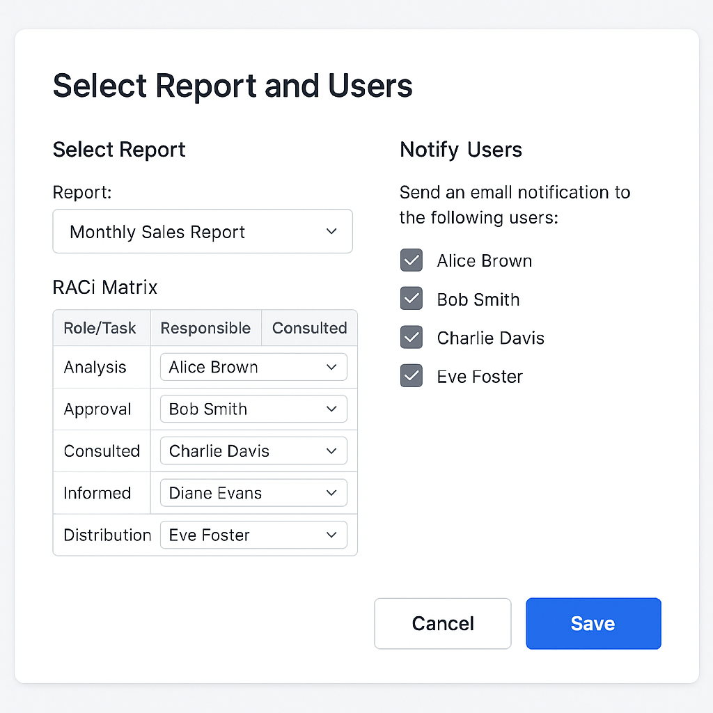

### 📬 Matriz RACI y Notificaciones

🛠️ Módulo de Notificaciones de Reportes para Administradores
Este módulo permite a los administradores configurar notificaciones automáticas para reportes seleccionados y asignar responsabilidades según el modelo de matriz RACI. Básicamente, una herramienta para que el caos se vea organizado... o al menos tenga culpables bien definidos.

📋 Funcionalidades
Selección de Reportes: Elige entre una lista de reportes disponibles (por ejemplo: Ventas Mensuales, Plan Anual, etc.).

Configuración de Notificaciones: Selecciona los usuarios que recibirán correos electrónicos automáticos cuando el reporte se actualice.

Asignación de Roles con Matriz RACI: Define roles (Responsable, Aprobador, Consultado, Informado) por usuario y tarea.

Plantilla de Correo Personalizable: Campo editable con variables dinámicas como {{reporte_nombre}}, {{fecha}}, etc.

Botones de Guardar y Cancelar: Cumplen su propósito y no intentan ser más de lo que son.

🧭 Flujo de Usuario
Ingresa al Centro de Reportes.

Selecciona un reporte desde el menú desplegable.

Asigna usuarios a roles utilizando la tabla Matriz RACI.

Marca qué usuarios deben ser notificados.

Haz clic en Guardar y siéntete como si tuvieras el control.

Olvida lo que hiciste y pregúntate por qué todos están molestos contigo en dos semanas.

🧩 Notas Técnicas
Estructura basada en componentes, pensada para modularidad y reusabilidad.

Diseñado con buenas prácticas modernas de UI/UX, sin fuegos artificiales.

Listo para integrarse con endpoints de backend que gestionen metadatos de reportes y servicios de notificación.

🖼️ Vista Previa de la Interfaz
Consulta la imagen adjunta en la carpeta mockups/ o donde sea que la hayas dejado tirada.

